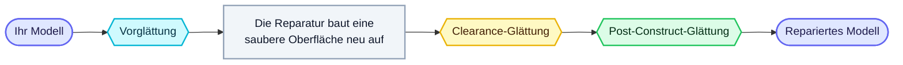

<Frame>
  
</Frame>

Die Glättung macht die Oberfläche Ihres Modells während der Reparatur weicher und runder. Ein Teil davon geschieht **vor** der Reparatur (Ihr Originalmodell wird entspannt, sodass die Reparatur von einer weicheren Form ausgeht) und ein Teil **nach** der Reparatur (nur die neu aufgebaute Oberfläche wird entspannt). Sie sind nicht austauschbar — die Glättung vor der Reparatur verändert die eingehende Form und wirkt sich auf das gesamte Ergebnis aus, während die Glättung nach der Reparatur die neue Oberfläche ausgleicht, ohne das Eingehende zu verändern. Sie lassen sich kombinieren.

## Wann Sie dies verwenden

Die Glättung lässt sich auf jedes Modell anwenden — Charaktere, Scans und mechanische Teile gleichermaßen. Wählen Sie Ihre Einstellungen nach der Art der gewünschten Oberfläche:

- **Charaktere / Figuren / organische Modelle** — schalten Sie die Glättung ein, um eine weichere Oberfläche mit weniger Facettierung an Gesichtern, Händen und Rundungen zu erhalten.
- **Mechanische / CAD-Teile** — lassen Sie die Glättung aus (oder sehr niedrig), damit scharfe Kanten scharf bleiben.
- **Verrauschte Scans** — eine geringe Glättung beseitigt Unebenheiten und Scan-Artefakte.

## Einstellungen

Die Glättung wird über einen zentralen **Glättung**-Schalter in den Reparatureinstellungen gesteuert. Sie ist **standardmäßig ausgeschaltet**, wodurch die reparierte Oberfläche maximale Details behält. Beim Einschalten werden die drei unten stehenden Regler eingeblendet und ihre empfohlenen Werte angewandt.

### Glättung (Hauptschalter)
Glättung ein- oder ausschalten. **Standard: Aus.** Wenn ausgeschaltet, sind alle drei Stufen deaktiviert und die Oberfläche behält ihre feinsten Details.

### Vorglättung — vor der Reparatur
Ein Schalter, der Ihr **Originalmodell** weicher macht, bevor es repariert wird. Dies reduziert Facettierung und Treppenstufen-Effekte im gesamten Endergebnis. **Wird automatisch eingeschaltet, wenn Sie die Glättung aktivieren.** Da es die in die Reparatur eingehende Form verändert, schalten Sie es aus, um scharfe Originalkanten zu erhalten — am besten für mechanische / CAD-Teile; lassen Sie es für organische und Charaktermodelle eingeschaltet.

### Clearance-Glättung (0–256) — während des Neuaufbaus
Ein Schieberegler, der Details am **Volumenkörper** abrundet, **während die Reparatur ihn neu aufbaut**. **Standard: 128.** Bei 0 bleiben die feinsten Details erhalten; höhere Werte entfernen mehr Unebenheiten und Rauschen, bevor die neue Oberfläche fertiggestellt wird.

### Post-Construct-Glättung (0–50) — nach der Reparatur
Ein Schieberegler, der die **neu aufgebaute Oberfläche** nach der Reparatur entspannt. Dies ist der am häufigsten verwendete Glättungsregler. **Standard: 8.** Bei 0 bleiben feine Details direkt aus der Reparatur erhalten; jeder höhere Schritt gleicht die Oberfläche etwas mehr aus und macht kleine Merkmale weicher.

### Kurzübersicht

| Einstellung | Wann sie wirkt | 0 / Aus | Höher / Ein | Standard bei Ein |
|---|---|---|---|---|
| **Vorglättung** | Vor der Reparatur | Behält scharfe Originalkanten | Weichere Oberfläche, weniger Facettierung | Ein |
| **Clearance-Glättung** | Während des Neuaufbaus | Feinste Details bleiben erhalten | Rundet Details am Volumenkörper ab | 128 |
| **Post-Construct-Glättung** | Nach der Reparatur | Feinste Details bleiben erhalten | Glattere Oberfläche, weiche kleine Merkmale | 8 |

## Einstellungen nach Modelltyp wählen

- **Mechanische / CAD-Teile** (scharfe Kanten wichtig) — Glättung **aus**, oder Post-Construct niedrig (0–2). Vorglättung **aus** lassen.
- **Charaktere / Figuren / organische Modelle** (glatte Oberflächen bevorzugt) — Glättung **ein**, Post-Construct **8**, Vorglättung **ein**.
- **Verrauschte Scans** — ein geringer Clearance-Glättungswert zum Bereinigen des Volumens, plus Post-Construct **8**.

## Tipps

- Höhere Post-Construct- und Clearance-Werte machen die Oberfläche weicher und können feine Details wie Falten, Gravuren und dünne Reliefs auslöschen — verringern Sie sie, um mehr Details zu behalten.
- Die Glättung ändert nicht die Anzahl der Polygone Ihres Modells. Die Polygonanzahl wird separat über den Regler [Ziel-Polygonanzahl](/editor/tools/target-faces) / Intelligente Polygonanzahl festgelegt.
- Dies sind Reparatureinstellungen — sie werden während der Reparatur angewandt, nicht als eigenständige Operation.

<Note>
  VRM-/VRoid-Dateien werden automatisch anhand ihrer Dateiendung erkannt, sodass es keinen separaten VRM-Glättungsschalter gibt. Verwenden Sie die obigen Glättungsregler für Charaktermodelle genauso wie für jedes andere Modell.
</Note>
