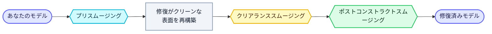

<Frame>
  
</Frame>

スムージングは、修復中にモデルの表面を柔らかく丸くします。その一部は修復の**前**に行われ（元のモデルを緩めることで、修復がより柔らかな形状から再構築されます）、一部は修復の**後**に行われます（再構築された表面のみを緩めます）。両者は互換ではありません — 修復前のスムージングは入力される形状を変え、結果全体に影響しますが、修復後のスムージングは入力されたものには手を加えず、新しい表面を均します。これらは組み合わせて使用できます。

## 使用するタイミング

スムージングは、キャラクター、スキャン、機械部品を問わず、あらゆるモデルに適用できます。求める表面の種類に応じて設定を選んでください：

- **キャラクター / フィギュア / 有機的なモデル** — スムージングをオンにすると、顔、手、曲面のファセットが減り、より柔らかな表面になります。
- **機械 / CAD部品** — シャープなエッジを鋭く保つため、スムージングはオフ（または非常に低く）のままにします。
- **ノイズの多いスキャン** — わずかなスムージングで凹凸やスキャンのアーティファクトを整えます。

## 設定

スムージングは、修復設定にある**スムージング**のマスタートグルで制御します。**デフォルトではオフ**で、修復後の表面を最大のディテールに保ちます。オンにすると下記の3つのコントロールが表示され、推奨値が適用されます。

### スムージング（マスタートグル）
スムージングのオン/オフを切り替えます。**デフォルト：オフ。**オフの場合、3つの段階すべてが無効になり、表面は最も細かいディテールを保ちます。

### プリスムージング — 修復の前
**元のモデル**を修復される前に柔らかくするトグルです。これにより最終結果全体のファセットや階段状のギザつきが軽減されます。**スムージングを有効にすると自動的にオンになります。**修復に入る形状を変えるため、シャープな元のエッジを保つにはオフにします — 機械 / CAD部品に最適です。有機的なモデルやキャラクターモデルではオンのままにします。

### クリアランススムージング（0–256）— 再構築中
**修復がソリッドを再構築している間に**、そのディテールを丸めるスライダーです。**デフォルト：128。**0では最も細かいディテールが保たれます。値を高くすると、新しい表面が確定する前により多くの凹凸やノイズが取り除かれます。

### ポストコンストラクトスムージング（0–50）— 修復の後
修復後に**再構築された表面**を緩めるスライダーです。これは最もよく使われるスムージングコントロールです。**デフォルト：8。**0では修復から得られた細かいディテールがそのまま保たれます。ステップを高くするごとに表面が少しずつ均され、小さな特徴が柔らかくなります。

### クイックリファレンス

| 設定 | 作用するタイミング | 0 / オフ | 高く / オン | オン時のデフォルト |
|---|---|---|---|---|
| **プリスムージング** | 修復の前 | シャープな元のエッジを保つ | より柔らかな表面、ファセットが減少 | オン |
| **クリアランススムージング** | 再構築中 | 最も細かいディテールを保持 | ソリッドのディテールを丸める | 128 |
| **ポストコンストラクトスムージング** | 修復の後 | 最も細かいディテールを保持 | より滑らかな表面、小さな特徴が柔らかく | 8 |

## モデルタイプ別の設定選び

- **機械 / CAD部品**（シャープなエッジが重要）— スムージング**オフ**、またはポストコンストラクトを低く（0–2）。プリスムージングは**オフ**のままにします。
- **キャラクター / フィギュア / 有機的なモデル**（滑らかな表面が好ましい）— スムージング**オン**、ポストコンストラクト**8**、プリスムージング**オン**。
- **ノイズの多いスキャン** — ボリュームを整えるための低いクリアランススムージング値に、ポストコンストラクト**8**を加えます。

## ヒント

- ポストコンストラクトとクリアランスの値を高くすると表面が柔らかくなり、しわ、彫刻、薄いレリーフなどの細かいディテールが消えることがあります — より多くのディテールを保つには値を下げてください。
- スムージングはモデルのポリゴン数を変えません。ポリゴン数は[ターゲット面数](/editor/tools/target-faces) / スマートポリゴン数のコントロールで別途設定します。
- これらは修復設定です — スタンドアロンの操作ではなく、修復時に適用されます。

<Note>
  VRM / VRoidファイルは拡張子によって自動的に検出されるため、専用のVRMスムージングトグルはありません。キャラクターモデルにも、他のどのモデルと同じように上記のスムージングコントロールを使用してください。
</Note>
